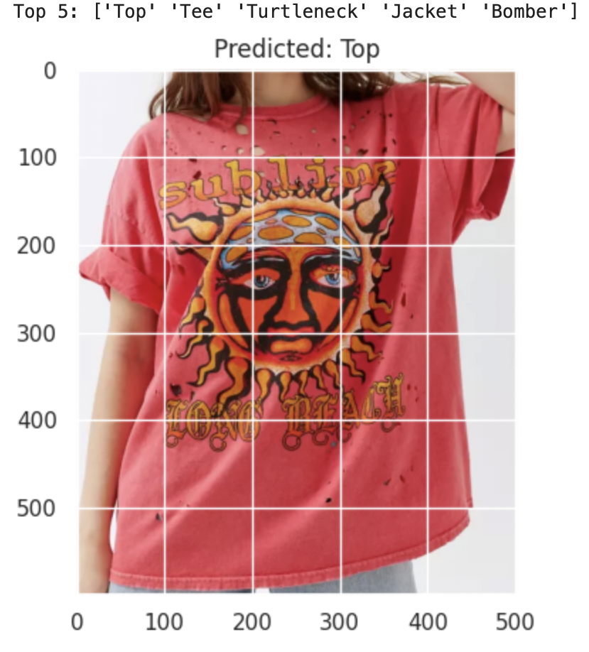

# DeepFashion Image Classification

## Overview

DeepFashion Image Classification is a **neural network project focused on classifying clothing items from the DeepFashion dataset**. This repository provides tools and models for recognizing clothing categories in images, supporting research and applications in fashion recognition, e-commerce, and computer vision.

## Motivation

Fashion image understanding is a challenging and impactful problem with applications in recommendation systems, virtual try-ons, and inventory management. The DeepFashion dataset is a standard benchmark in this space, but its complexity and variety make robust classification a demanding task. This project aims to **provide reproducible, extensible pipelines and strong baseline models for DeepFashion category classification**.

## Dataset Description

The [DeepFashion Category and Attribute Prediction Benchmark](https://mmlab.ie.cuhk.edu.hk/projects/DeepFashion/AttributePrediction.html) is used in this project. 

- **Number of Images:** Over 289,000 images.
- **Categories:** 50 clothing categories (e.g., dress, shirt, jeans, skirt, etc.).
- **Attributes:** Each image is annotated with one or more clothing attributes (not the focus of the current repo, but easily extendable).
- **Splits:** Provided splits for training, validation, and testing, with corresponding bounding boxes and category labels.

**To get started, download these files to `data/raw/`:**
- `Img/img.zip`
- `Anno_fine/train_cate.txt`
- `Anno_fine/train.txt`
- `Anno_fine/train_bbox.txt`
- `Anno_fine/test_cate.txt`
- `Anno_fine/test.txt`
- `Anno_fine/test_bbox.txt`
- `Anno_fine/val_cate.txt`
- `Anno_fine/val.txt`
- `Anno_fine/val_bbox.txt`
- `Anno_fine/list_category_cloth.txt`

## Model Architecture

Multiple model architectures are supported and easy to extend:

- **BaselineCNN:** A simple convolutional neural network with:
  - 2 convolutional layers (ReLU activations + max pooling)
  - 3 fully connected layers (ReLU activations)
  - Final output layer with units equal to the number of categories
- **Pre-trained Models:** Plug-and-play support for classic model backbones, e.g.:
  - **AlexNet:** Pre-trained on ImageNet, classifier replaced for fashion classes.
  - **ResNet34:** Pre-trained backbone, final layer replaced for DeepFashion categories.
  - **MobileNet, ViT, Swin Transformer:** Supported via HuggingFace/TimM for modern transfer learning.

All models use softmax activation for classification. Pre-trained backbones can be partially or fully frozen/unfrozen for fine-tuning.

## Training Details

- **Configurable via YAML files** in `configs/`
- **Training Parameters:**
  - Learning rate (e.g., 1e-3 default, configurable)
  - Batch size (e.g., 32/64)
  - Number of epochs (e.g., 10-50 typical)
  - Optimizer: Adam (default), SGD, or others via config
  - Data augmentation: Resize, CenterCrop, HorizontalFlip, ColorJitter, Rotation, GaussianBlur, Normalization (ImageNet stats for pre-trained)
  - Rebalancing: number of desired samples per class (e.g max_samples: 500)
  - Downsampling: randombly sample subset of images within a certain class with more than max_samples (e.g. True)
  - Class Filtering: Easily restirct training and evaluation to a subset of clothing categories
- **Workflow:**
  - Define model/config in `src/models/` and `configs/`
  - Launch training:  
    ```
    python3 train.py --config config_filename.yaml
    ```

## Evaluation Metrics

After training, models are evaluated on the test set using:

- **Accuracy** (overall and per-class)
- **Precision, Recall, F1-score** (macro and micro)
- **Confusion Matrix** (visualization saved as PNG)
- **Classification Report:** Saved as JSON and CSV (true vs predicted labels)

## Results

Results are automatically saved to the `experiments/` directory. Example outputs include:

- `report.json`: Full classification report (accuracy, precision, recall, F1)
- `predictions.csv`: True vs. predicted labels
- `confusion_matrix.png`: Visual confusion matrix
- *Sample predictions and images:* Use `predict.py` for inference on custom images.

> #### Prediction Example:   
> 

## Installation and Usage

### Getting Started

Clone the repository:
```bash
git clone https://github.com/rainalexotl/deepfashion-image-classification.git 
```

**Download the DeepFashion data** (see Dataset section above) and place the files in `data/raw`.

### Training a Model

```bash
python3 train.py --config config_filename.yaml
```

### Training a New Custom Model - Workflow

| What You Want to Do     | What to Do |
| ----------------------- | ---------- |
| New architecture        | Define a new model in `src/models/`, register it in `factory.py`, create a new config YAML file pointing to it. Place it in `configs/`. |
| New hyperparameters     | Create or edit a config YAML with new values (learning rate, batch size, etc.). |
| Run experiment          | `python train.py --config my_new_experiment.yaml` |

### Continue Training from Checkpoint

```bash
python3 train.py --config new_config_file.yaml --checkpoint path/to/checkpoint.pt
# Example:
python3 train.py --config baseline_epochs20.yaml --checkpoint experiments/baseline/checkpoints/last_model.pt
```

### Evaluating a Model

```bash
python3 eval.py --config config_filename.yaml --checkpoint path/to/checkpoint.pt [-s]
```
Add `-s` to save evaluation results (classification report JSON and prediction CSV).

### Run Inference on an Image

```bash
python3 predict.py path/to/image_file --config config_filename.yaml --checkpoint path/to/checkpoint.pt [--topk 5]
```

---

*Pull requests and new model/config contributions are welcome! For questions or results, open an issue or discussion.*
